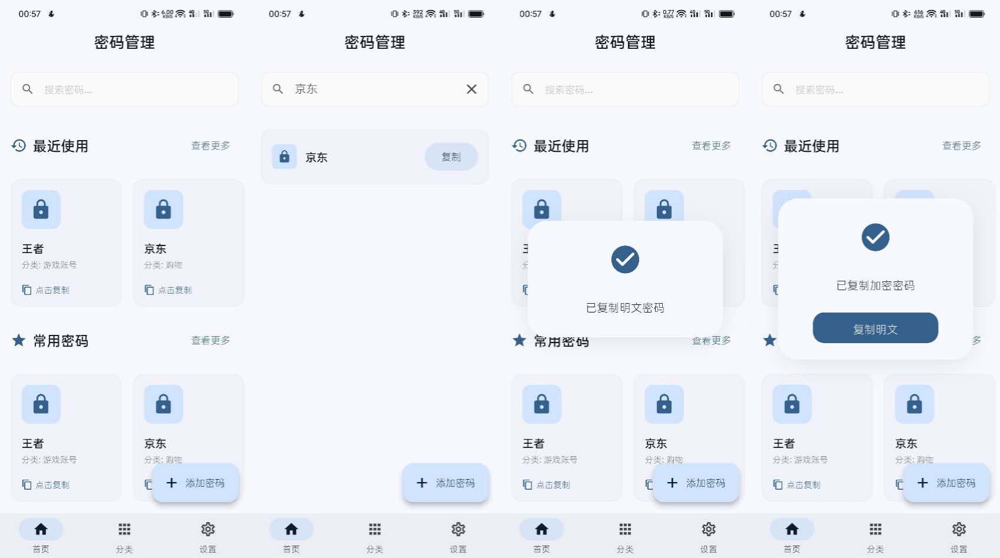
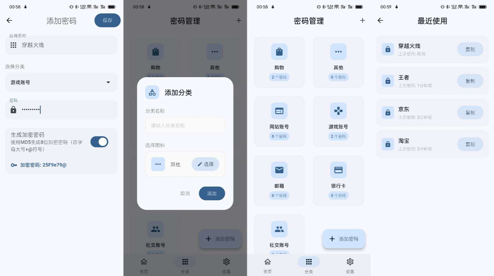

# code_book

由 Cursor 使用 Flutter 框架构建的 密码本 安卓APP

## 运行环境

```shell

PS D:\cursor\code_book> flutter --version  
Flutter 3.24.3 • channel stable • https://github.com/flutter/flutter.git
Framework • revision 2663184aa7 (5 months ago) • 2024-09-11 16:27:48 -0500
Engine • revision 36335019a8
Tools • Dart 3.5.3 • DevTools 2.37.3

```

```shell
PS D:\cursor\code_book> flutter doctor
Flutter assets will be downloaded from https://storage.flutter-io.cn. Make sure you trust this source!
Doctor summary (to see all details, run flutter doctor -v):
[√] Flutter (Channel stable, 3.24.3, on Microsoft Windows [版本 10.0.19044.5371], locale zh-CN)
[√] Windows Version (Installed version of Windows is version 10 or higher)
[√] Android toolchain - develop for Android devices (Android SDK version 35.0.0)
[√] Chrome - develop for the web
[X] Visual Studio - develop Windows apps
    X Visual Studio not installed; this is necessary to develop Windows apps.
      Download at https://visualstudio.microsoft.com/downloads/.
      Please install the "Desktop development with C++" workload, including all of its default components
[√] Android Studio (version 2024.1)
[√] IntelliJ IDEA Ultimate Edition (version 2023.3)
[√] Connected device (3 available)
[√] Network resources

```

## 功能简介

* 保存密码防止忘记
* 提供密码加密，使用时使用加密后的密码，防止密码泄露 。如：用户各平台的密码一致或类似，此时只要有一个平台的密码泄露就会对其他平台造成风险。
* 开发者可以自定义加密规则





## 自定义加密规则

在 /code_book/lib/services/encryption_service.dart  下修改。

``` dart
// 示例加密逻辑，请自行增强加密服务的健壮性
class EncryptionService {
  static String encrypt(String text) {
    // 1. 计算完整的MD5（32位小写）
    final bytes = utf8.encode(text);
    final fullMd5Lower = md5.convert(bytes).toString();
    
    // 2. 取前8位小写
    final md5_8_lower = fullMd5Lower.substring(0, 8);
    
    // 3. 将第一个字母转为大写
    String md5_8_upper_first = md5_8_lower;
    for (int i = 0; i < md5_8_lower.length; i++) {
      if (RegExp(r'[a-z]').hasMatch(md5_8_lower[i])) {
        md5_8_upper_first = md5_8_lower.substring(0, i) + 
                           md5_8_lower[i].toUpperCase() + 
                           md5_8_lower.substring(i + 1);
        break;
      }
    }
    // 4. 前7位 + @符号
    final result = md5_8_upper_first.substring(0, 7) + '@';
    
    return result;
  }
} 
```

## 说明

* 软件未开发完成，只实现了部分功能
* 软件未进行测试，可能存在功能问题
